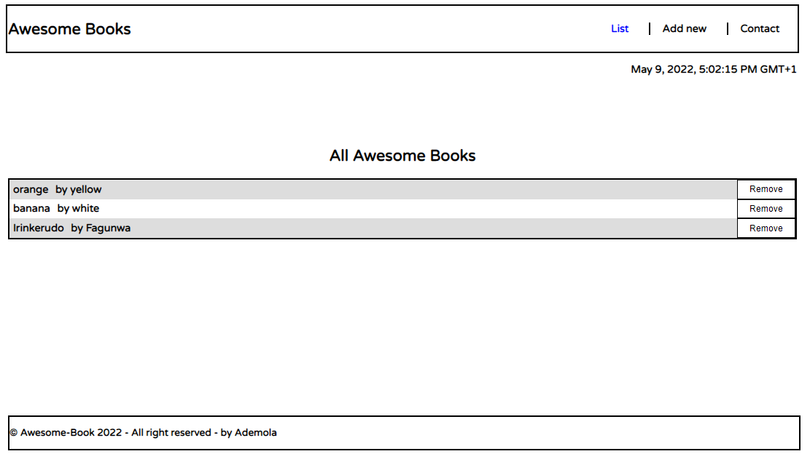

# Awesome-Books with ES6
This project embodies a basic website that allows users to add/remove books from a list using ES6 syntax. JavaScript objects and arrays were used.

## Built With

- JS
- HTML
- CSS
- Github

## Live Demo

[Live Demo](https://smart1-hub.github.io/Awesome-Books-ES6/)

## Getting Started

To get a local copy up and running:

1. Clone this repository or download the Zip folder:

**``https://github.com/Smart1-hub``**

1. Navigate to the location of the folder in your machine:

**``you@your-Pc-name:~$ cd <folder>``**

## Author

👤 **Ademola Adebayo**

- Github: [@Ademola](https://github.com/Smart1-hub)

- Twitter: [@ademola_adebayo](https://twitter.com/ademola_adebayo)

- LinkedIn: [Ademola Adebayo](https://www.linkedin.com/in/ademola-adebayo-81051578/)

## Acknowledgement

- Microvers Org.
- All whose codes have been built on

## Contributing

Contributions, issues, and feature requests are welcome!

## Show your support

Give a ⭐ if you like this project and how it is built!

## 📝 License

This project is [MIT](https://github.com/microverseinc/readme-template/blob/master/MIT.md) licensed.